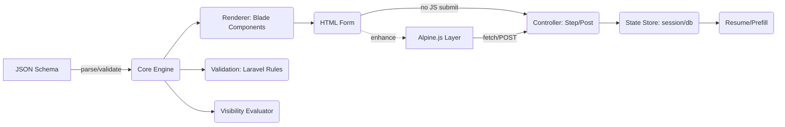
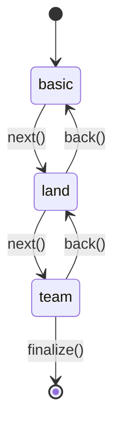

# Stitch Wizard — JSON-driven Multi-Step Form for Laravel + Alpine.js

## 1) Purpose and Scope
- Build a reusable Laravel package that renders and processes progressive, multi-step forms from a JSON schema. Supports Alpine.js progressive enhancement, Tailwind-compatible UI, server-side validation, and AJAX step navigation.
- Advanced fields: repeater, Thai land area (Rai/Ngan/Square Wah), quarter selector (Q1–Q4). Conditional visibility and computed defaults.
- Progressive enhancement: fully functional without JS; Alpine enhances UX when present.

## 2) Package Name and Composer
- Package name: stitch-wizard/stitch-wizard
- PHP: 8.2+
- Laravel: 11–12
- Frontend: Alpine.js 3.x; optional plugins: persist, mask (internal usage where helpful)

Example composer.json excerpt:
{
  "name": "stitch-wizard/stitch-wizard",
  "type": "library",
  "require": {
    "php": ">=8.2",
    "illuminate/support": "^11.0|^12.0"
  },
  "autoload": {
    "psr-4": { "StitchWizard\\": "src/" }
  },
  "extra": {
    "laravel": { "providers": ["StitchWizard\\StitchWizardServiceProvider"] }
  }
}

## 3) High-level Architecture


## 4) JSON Schema (v1)
[content unchanged]

## 5) Visibility Expressions
[content unchanged]

## 6) Field: Thai Area (Rai/Ngan/Wah)
[content unchanged]

## 7) Field: Quarter Selector (Q1–Q4)
[content unchanged]

## 8) Validation Strategy
[content unchanged]

## 9) Progressive Enhancement & UX
- No-JS baseline: `<form>` posts to /wizard/{id}/step/{key}; server returns next step or errors.
- With JS: use Alpine.js plus the alpine-ajax plugin to submit steps asynchronously and swap server-rendered partials into the target container; maintain accessibility (plugin manages aria-busy).
- Accessibility:
  - Stepper: `<ol>` with aria-current="step" on active item.
  - Error summary region role="alert" aria-live="polite"; link errors to inputs via aria-describedby.
  - Focus management: move focus to step heading on change; send error focus to first invalid input.

Stepper markup snippet:
```html
<ol class="wizard-steps" aria-label="Steps">
  <li aria-current="step">Basic</li>
  <li>Land</li>
  <li>Team</li>
</ol>
```

## 10) Blade Components
[content unchanged]

## 11) Routes and Controllers
- Routes (prefix configurable):
  - GET /wizard/{id} → first step (server-render)
  - POST /wizard/{id}/step/{key} → validate + persist + compute next
  - POST /wizard/{id}/finalize → validate all + submit callback
- Return partial Blade fragment (step panel) on step success for alpine-ajax targets; return JSON `{ errors }` with HTTP 422 on validation errors.
- Storage: default session; optional DB via contract WizardStateStore.

Interface:
```php
interface WizardStateStore {
  public function get(string $wizardId): array;
  public function put(string $wizardId, array $data): void;
  public function clear(string $wizardId): void;
}
```

## 12) Alpine.js + Alpine AJAX Layer
- Ship ESM build importable as `@stitch-wizard/alpine`.
- Adopt imacrayon/alpine-ajax (v0.12.x) for network interactions: attach directive to forms/links and declare a target container per official docs; plugin handles fetch, error states, and DOM swap. 
- `x-data` still exposes: `stepKey`, `values`, `errors`, `isBusy`; methods: `addRow/removeRow/setValue`. Network actions delegate to alpine-ajax.
- Server returns partial HTML for the step panel on success; JSON with errors when validation fails; plugin inserts into target; focus management occurs after swap.

State transitions:


## 13) Tailwind & Assets
[content unchanged]

## 14) Configuration
[content unchanged]

## 15) Security & Reliability
[content unchanged]

## 16) Testing Stack, TDD + E2E (Red → Green → Refactor → Monitor)
### 16.1 Unit / Feature (PHP)
- Prefer Pest over PHPUnit (quicker authoring; parallel runner by default in Laravel 11/12).
- Still compatible with raw PHPUnit where needed (pest sits atop the engine).

### 16.2 End-to-End (Browser)
- Default: Playwright (fast, cross-browser, robust auto-waits).
- Provide Cypress recipe as alternative.
- Laravel Dusk optional for full PHP stack but slower/flakier for heavy JS UIs.

### 16.3 Static Analysis & Quality
- PHPStan (level 6+) with larastan — faster feedback than Psalm.
- Coding Standard: Laravel Pint.
- Mutation Testing: Infection PHP (optional nightly job).
- Coverage: PCOV driver instead of Xdebug for speed.

### 16.4 Continuous Integration
- GitHub Actions matrix: PHP 8.2 / 8.3 × Laravel 11 / 12.
- Cache Composer & npm; run `pest --parallel`, PHPStan, Pint, Infection (nightly).
- Run Playwright tests headless across Chromium + WebKit.

### 16.5 Workflow
1. **Red** – write a failing test (unit/feature/E2E).
2. **Green** – implement minimal code to pass.
3. **Refactor** – improve design keeping tests green.
4. **Monitor** – CI enforces ≥90 % coverage, static analysis zero errors; Playwright smoke flows run on push.

Existing low-level test bullets from prior section are preserved within this overall strategy.

## 17) Tooling Comparisons (choices for performance)
- Pest vs PHPUnit: choose **Pest** (faster authoring, built-in parallel).
- Playwright vs Cypress vs Dusk: choose **Playwright** (speed & cross-browser); Cypress acceptable; Dusk optional.
- PCOV vs Xdebug for coverage: choose **PCOV** (significantly faster).
- PHPStan vs Psalm: choose **PHPStan** (faster feedback).
- Assets: Vite (Laravel) with Alpine 3 + alpine-ajax only; no heavy SPA framework.

## 18) Developer Tickets & Acceptance Criteria
1) Package bootstrap  
2) JSON schema validator  
3) Visibility engine (server + Alpine mirror)  
4) ThaiArea utilities + Blade component  
5) Quarter field + config mapping  
6) Repeater engine  
7) Controllers & routes  
8) Blade form/fields/rendering  
9) Alpine enhancement with alpine-ajax  
   - AC: Forms/links use alpine-ajax directives; partial replace; aria-busy observed; a11y checks pass.  
10) Docs & examples  
11) **E2E tests**  
   - AC: Playwright flows cover next/back, validation errors, finalize happy-path; run headless in CI.

## 19) Delivery Milestones
[content unchanged]

## 20) Example Controller + Routes (sketch)
[content unchanged]

## 21) Accessibility Checklist (WCAG-ish)
[content unchanged]

## 22) Performance Notes
- Server-rendered partials over JSON view-models to minimize client compute.
- Use PCOV in CI for coverage speed.
- Parallelize Pest tests.
- Debounce client input where live computations occur (e.g., Thai area to sqm).
- Lazy-load Alpine ESM only on pages using the wizard.

## 23) Open Questions (leave configurable)
[content unchanged]

## 24) References
- Thai land measures: Sunway Estates — https://sunwayestates.com/article/thai-land-measurements; Conrad Properties — https://www.conradproperties.asia/buyers-guide/thailand-land-measurements; Ubon Homes — https://ubonhomes.com/resources/land-measurement-2/
- Quarters mapping: Wikipedia Calendar year — https://en.wikipedia.org/wiki/Calendar_year; U.S. News Quarter definition — https://money.usnews.com/investing/term/quarter
- Accessible steppers: Piccalilli — https://piccalil.li/tutorial/solution-008-progress-stepper/; Deque Cauldron Stepper — https://cauldron.dequelabs.com/components/Stepper
- Laravel conditional validation: Laravel Daily — https://laraveldaily.com/post/laravel-conditional-validation-other-fields-examples; Techsolutionstuff — https://techsolutionstuff.com/post/laravel-12-conditional-validation-required-if-nullable-and-more
- Package dev & testing: dev.to Testbench guide — https://dev.to/micoliveira/testando-e-implementando-pacotes-laravel-um-guia-passo-a-passo-1dn5; StackOverflow package guide — https://stackoverflow.com/collectives/php/articles/79585356/quick-guide-to-laravel-package-development; Skeleton — https://github.com/algoyounes/laravel-package-skeleton
- Alpine AJAX: Repo — https://github.com/imacrayon/alpine-ajax; Docs — https://alpine-ajax.js.org/

---
End of handoff.
