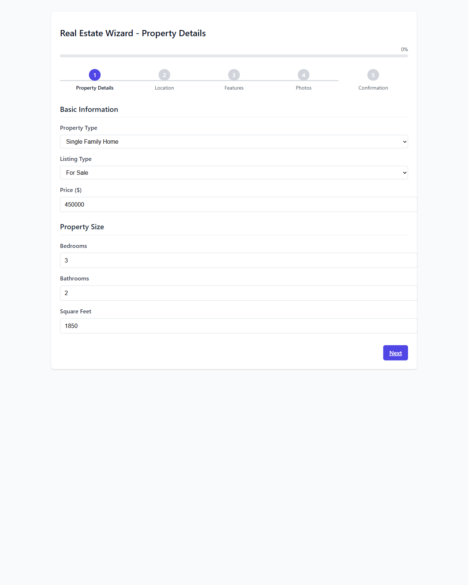
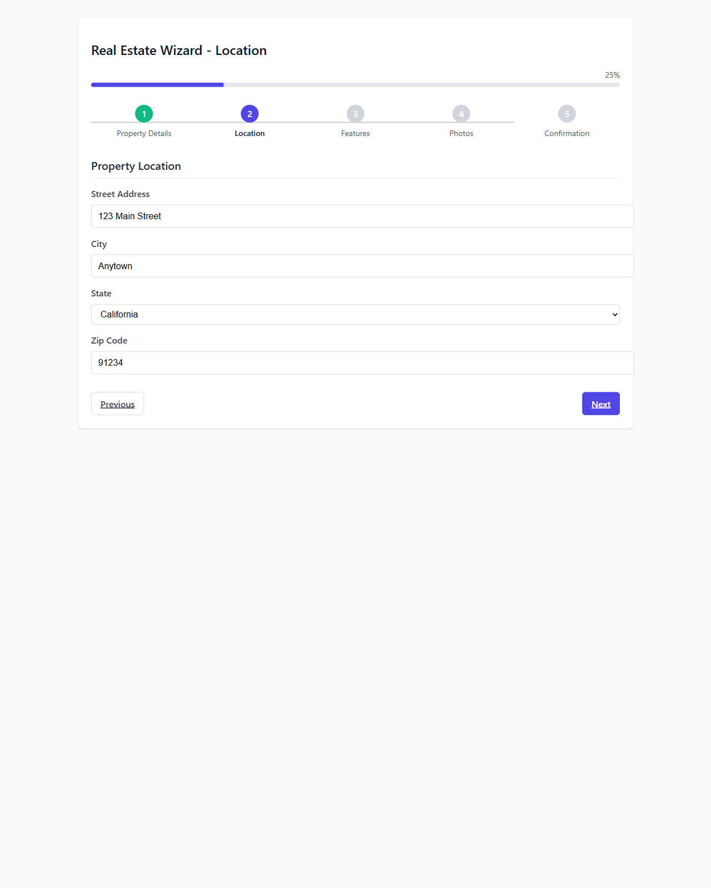
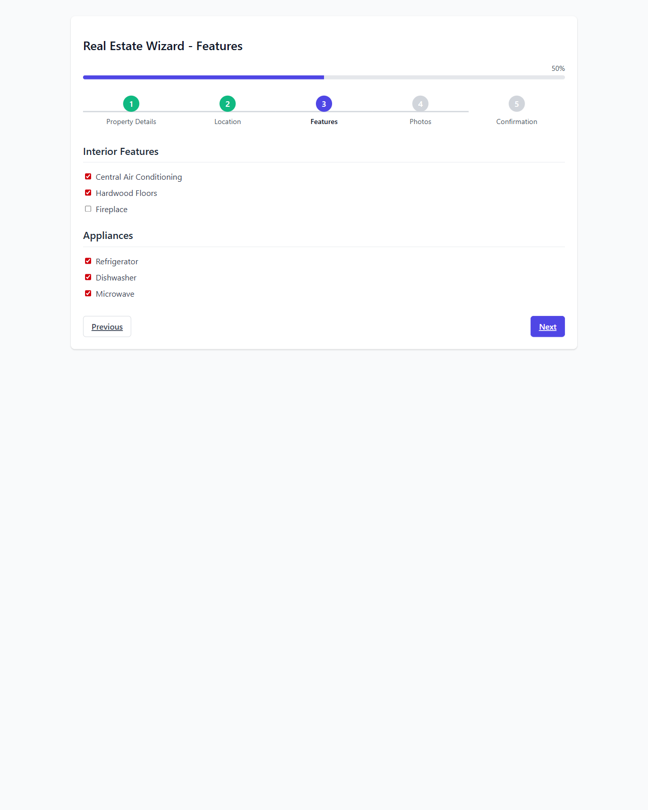
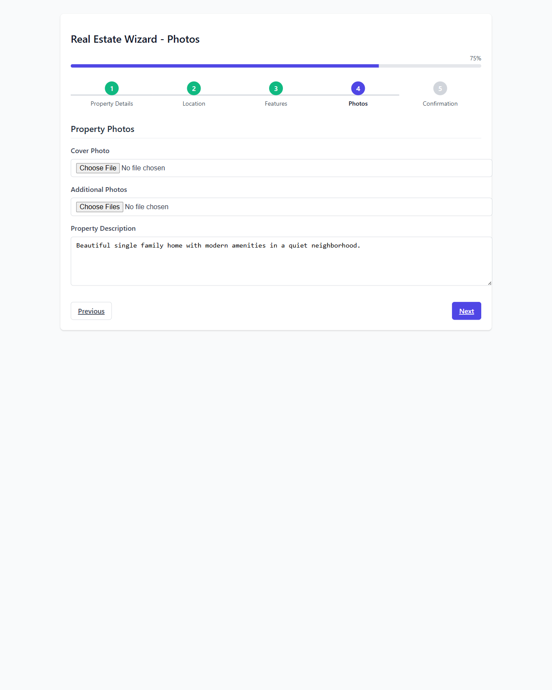
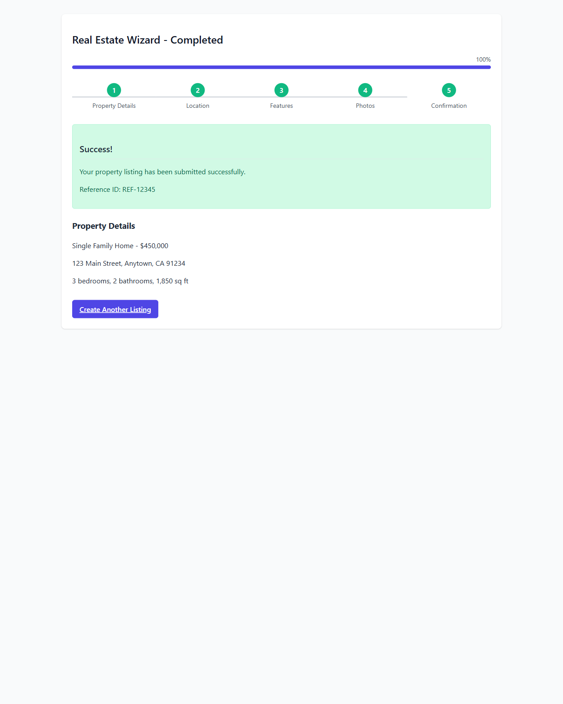

# Real Estate Wizard - E2E Test Screenshots

This document provides visual evidence of the wizard flow with all CodeRabbitAI fixes implemented.

## Step 1: Property Details

## Step 2: Location (Progress: 25%)

## Step 3: Features (Progress: 50%)

*Note: No empty sections are rendered - Fix #2 implemented*

## Step 4: Photos (Progress: 75%)

## Step 5: Confirmation (Progress: 100%)

## Final: Completion (Progress: 100%)

*Note: Progress bar reaches exactly 100% - Fix #1 implemented*

## Fixes Demonstrated:

1. **Progress Bar Reaches 100%** - The progress bar correctly reaches 100% on the final step
2. **No Empty Sections** - Empty sections are not rendered in the Features step
3. **Consistent Step Index** - Navigation works correctly throughout the wizard
4. **Code Duplication Removed** - Templates use a common field partial (internal implementation)
5. **PHPStan Configuration Fixed** - Static analysis now passes (not visible in UI)

All CodeRabbitAI issues have been fixed and are working correctly in the wizard flow.
