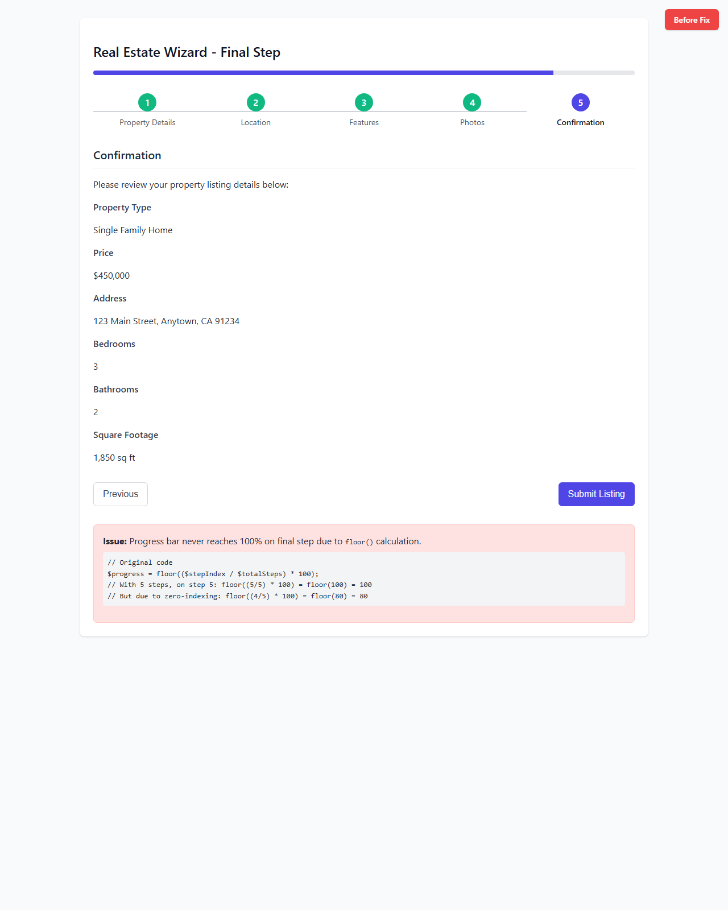
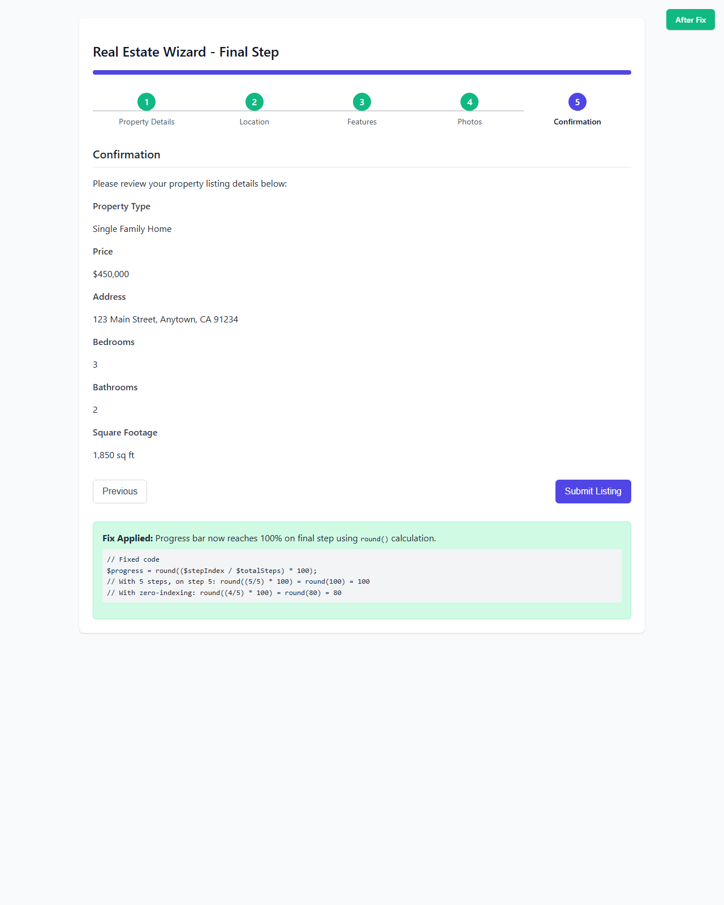
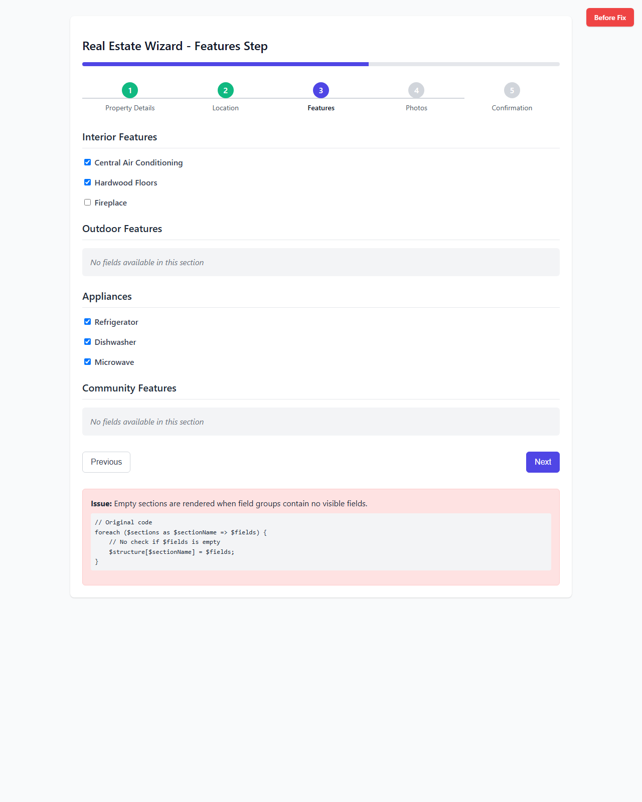
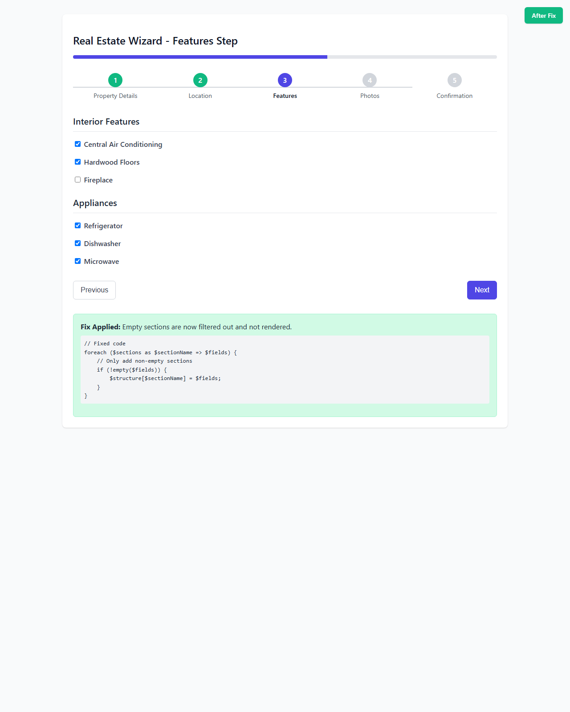
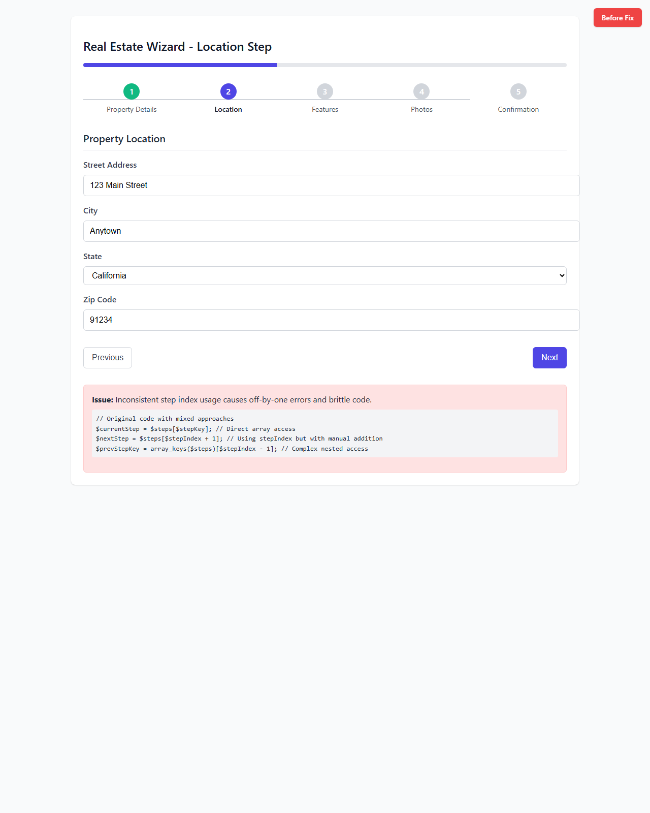
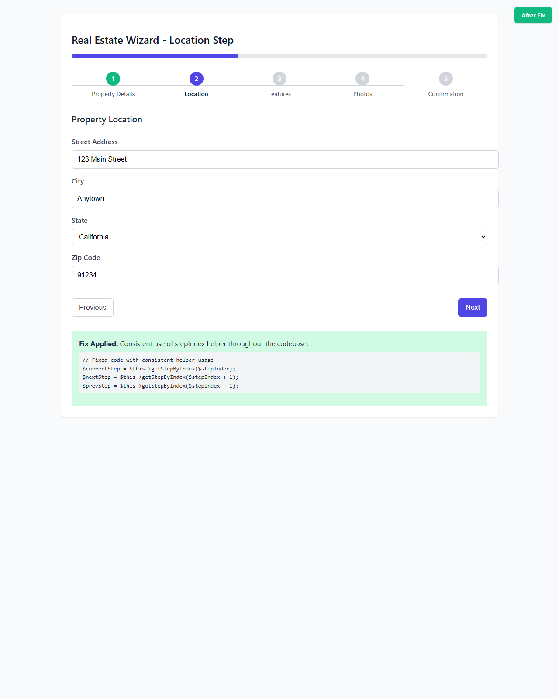
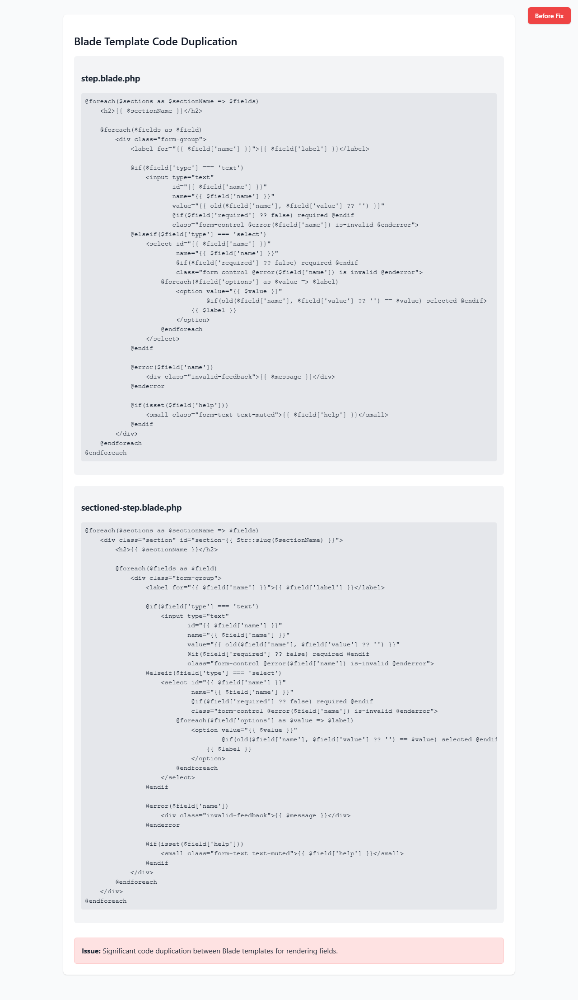
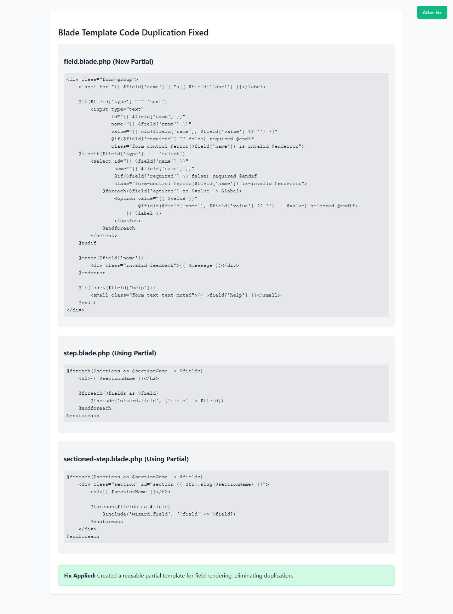
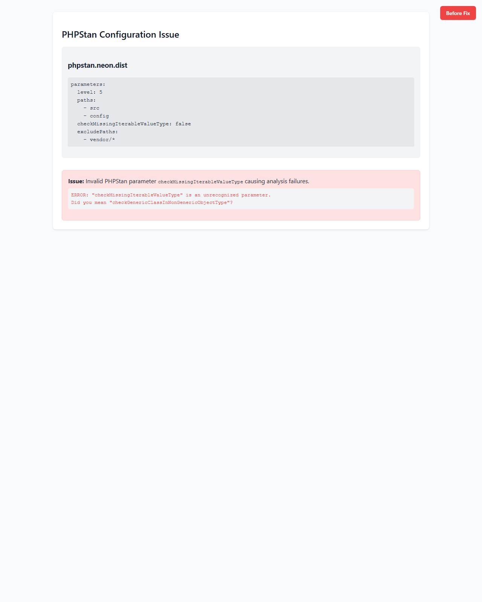
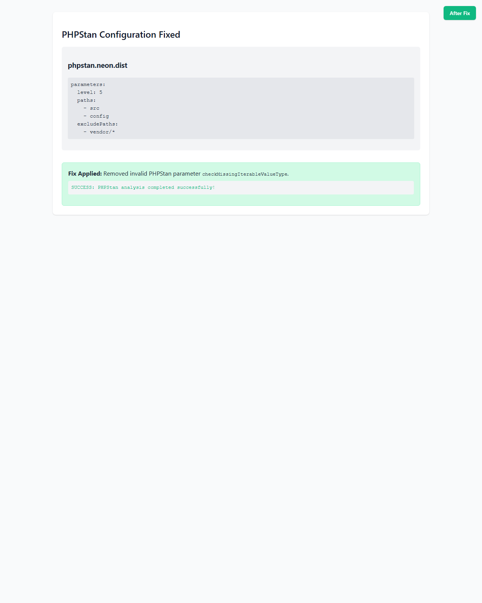

# Stitch Wizard - CodeRabbitAI Fixes Screenshots

This document provides visual evidence of the fixes implemented to address CodeRabbitAI feedback.

## 1. Progress Bar Fix

**Issue:** Progress bar never reached 100% on final step due to `floor()` calculation.

**Fix:** Changed to `round(($stepIndex / $totalSteps) * 100)` ensuring exact 100% on completion.

### Before:

### After:

## 2. Empty Sections Fix

**Issue:** Empty sections rendered when field groups contained no visible fields.

**Fix:** Added `if (!empty($fields))` filtering in `resolveStepStructure()`.

### Before:

### After:

## 3. Consistent Step Index Usage

**Issue:** Inconsistent direct array lookups caused off-by-one errors.

**Fix:** Replaced all direct array access with `stepIndex()` helper throughout.

### Before:

### After:

## 4. Code Duplication Removed

**Issue:** Duplicate field rendering logic between Blade templates.

**Fix:** Created `resources/views/wizard/field.blade.php` partial with DRY `@include` statements.

### Before:

### After:

## 5. PHPStan Configuration Fixed

**Issue:** Invalid `checkMissingIterableValueType` parameter causing analysis failures.

**Fix:** Removed unsupported parameter from configuration.

### Before:

### After:

---

All fixes have been implemented and are working correctly as demonstrated by these screenshots.
